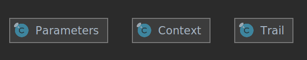
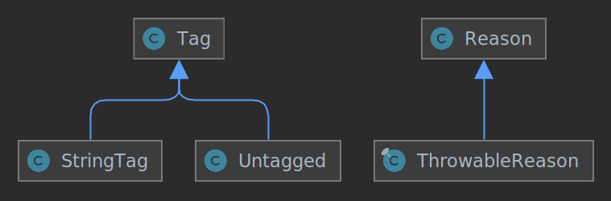
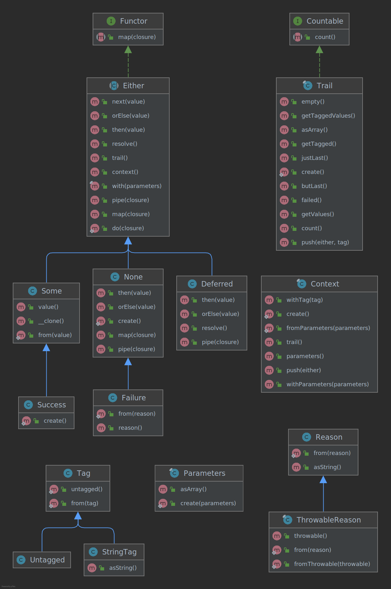

# Why

Either (inspired by the functional thing), helps to:
* Get rid of exceptions (Success/Failure).
* Discourage the use of null (None/Some).
* Simplify the control flow on errors.
* Build failsafe code
* Improve testability.

## Either

Is a supercharged version on the Either from functional programing, it provides functionality
present in such languages along some extra to solve some common use cases in php.

Some literature about, google for more:

https://www.thoughtworks.com/en-es/insights/blog/either-data-type-alternative-throwing-exceptions

https://itnext.io/either-monad-a-functional-approach-to-error-handling-in-js-ffdc2917ab2

https://functionalprogramming.medium.com/either-is-a-common-type-in-functional-languages-94b86eea325c

## Creating

Every either must be created using its appropriate class:

* None::create()
* Some::from($value)
* Either::start()->next(Closure $closure)
* Success::create()
* Failure::create()

*Either::next*, *Either::orElse*, *Either::pipe*, *Either::then* and *Deferred::resolve* methods will guess the *Either* kind to be created, by the following rules:

* *Either*: A clone of the *Either*
* *Closure*: A *Deferred*
* *null*: *None*
* Otherwise: *Some*


## Either

Base class for all *Either*s

An *Either* has a *Context* that contains the *Parameters* that will use to call *Deferred* closures (if any) and a *Trail* of the evaluated *Either*s.

A new *Either* with new *Parameters* can be build by *Either::with* method, *Trail* is readonly.





### resolve(): Either

Forces an optional to be resolved, return itself but on Deferred, an *Either* from its closure execution return value is returned.

```php
// \j45l\either\Test\Unit\ExamplesTest::testDo
// \j45l\either\Test\Unit\ExamplesTest::testDoOrElse
// \j45l\either\Test\Unit\ExamplesTest::testDoOrElseFails
$either =
    Either::start()->next($this->insertCustomer($em))->with($customer)
    // The parameters/context ($customer) is passed to orElse(), so does not need to
    // be provided again, although you could override that by using a second with().
    ->orElse($this->updateCustomer($em))
    // orElse() cause the closure from do() to be evaluated, orElse()'s closure is evaluated
    // on resolve() only when do() returns a none/failure
    ->resolve()
    // The value, either a Failure or a Success
;
```
If *resolve()* were not caller, the second closure would not be called (lazy).

### context(): Context

Returns the context of the *Either*, i.e. its trail and parameters
```php
// \j45l\either\Test\Unit\ExamplesTest::testGetContext
$increment = static function (Some $some): Some {
    return Some::from($some->value() + 1);
};

$either = Some::from(42)->pipe($increment)->pipe($increment);

$firstContextParameter = first($either->context()->parameters()->asArray());

$this->assertInstanceOf(Some::class, $firstContextParameter);
$this->assertEquals(43, $firstContextParameter->value());

$this->assertCount(2, $either->context()->trail());
$this->assertEquals([42, 43], $either->context()->trail()->values());
$this->assertEquals([42, 43, 44], $either->trail()->values());
```

Be aware that while Either::context()->trail does not include the Either itself, Either::trail() does.
### static do(Closure $closure): Deferred

Returns a *Deferred* from *$closure* (with the current context).

```php
// \j45l\either\Test\Unit\ExamplesTest::testDo
// \j45l\either\Test\Unit\ExamplesTest::testDoOrElse
// \j45l\either\Test\Unit\ExamplesTest::testDoOrElseFails
$either =
    Either::start()->next($this->insertCustomer($em))->with($customer)
    // The parameters/context ($customer) is passed to orElse(), so does not need to
    // be provided again, although you could override that by using a second with().
    ->orElse($this->updateCustomer($em))
    // orElse() cause the closure from do() to be evaluated, orElse()'s closure is evaluated
    // on resolve() only when do() returns a none/failure
    ->resolve()
    // The value, either a Failure or a Success
;
```

### map(Closure $closure): Deferred

Maps the *Either* value (i.e. calls *closure* with the *Either* as parameter).

Mapping a *None* results in a *None*, being the *closure* not evaluated.

Maps is from Functor, so it returns a Functor, that could be confusing when dealing with the result,
do some type assessment prior to its use, to ensure the expected type is the returned one.  

```php
// \j45l\either\Test\Unit\ExamplesTest::testMap
$sideEffect = false;
$increment = function (Some $number) use (&$sideEffect) {
    $sideEffect = true;
    return Some::from($number->value() + 1);
};
$either = Some::from(41)->map($increment); 

$this->assertFalse($sideEffect); $this->assertInstanceOf(Deferred::class, $either);
 
$either = $either->resolve(); $this->assertTrue($sideEffect);

$this->assertInstanceOf(Some::class, $either); 
$this->assertEquals(42, $either->value());

// Until Either::resolve() is called, the close $increment is not invoked, so neither
// the value gets changed nor the side effect occurs.
```

#### next($nextValue): Either

Returns an *Either* from *$nextValue* (with the current context).
$nextValue is always evaluated either the *Either* is a *None*, a *Some* or a *Deferred* (in which 
case is resolved) 

```php
//\j45l\either\Test\Unit\ExamplesTest::testNext
$noneNext = None::create()->next(42);
$someNext = Some::from(1)->next(42);

$this->assertInstanceOf(Some::class, $noneNext);
$this->assertInstanceOf(Some::class, $someNext);
$this->assertEquals(42, $noneNext->value());
$this->assertEquals(42, $someNext->value());
```

#### orElse($defaultValue): Either

Returns an *Either* from *$nextValue* (with the current context) if current Either is a *None*,
 otherwise returns itself.

```php
//\j45l\either\Test\Unit\ExamplesTest::testOrElse
$noneNext = None::create()->orElse(42);
$someNext = Some::from(1)->orElse(42);

$this->assertInstanceOf(Some::class, $noneNext);
$this->assertInstanceOf(Some::class, $someNext);
$this->assertEquals(42, $noneNext->value());
$this->assertEquals(1, $someNext->value());
```

#### pipe(Closure $closure): Either

Returns a *Deferred* from *closure* using current Either as context parameters and using curren trail.

#### resolve(): Either

On *Deferred*, its closure is evaluated and an *Either* from the evaluation result is returned. If the closure throws a *Throwable*, a *Failure* with the *Throwable* as reason is returned

#### then($nextValue): Either

Returns an *Either* from *$nextValue* (with the current context) if the current *Either* is not a *None*, otherwise returns itself.

#### trail(): Trail

Return the trail of *Either* adding itself at the end.

#### with(...$parameters): Either

Returns a clone of the *Either* changing the parameters on its context

## Other classes

### Deferred

A deferred *Either* that must be resolved in order to its *Closure* to be evaluated (called), 
a new *Either* from the *Closure* return is returned.

### Failure

A *Failure* is a *None* used for failed operations

#### from(Reason $reason = null): Failure

Returns a *Failure* with the given *$reason*

#### reason(): Reason

Returns the *Failure* reason

### None

Absence of value, equivalent to null (but without messing with the interface)

### Some

An *Either* with a value.

When cloned, if the value is an object, it is also cloned (not a deep clone, if desired, the value itself should do so)

#### from($value): Some

Returns a new *Some* from the *$value*, never modifies nor evaluates *$value*.

#### value()

Return the value

### Success

An *Either*(*Success* with true value) to signal successful operations 

 