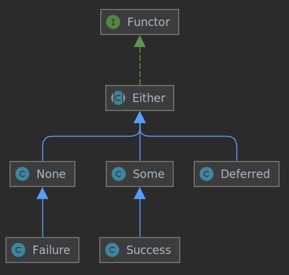

# Creating

A *maybe* must be created by using one of:

* None::create()
* Some::from($value)
* Maybe::start()->next(Closure $closure)
* Success::create()
* Failure::create()

*Maybe::next*, *Maybe::orElse*, *Maybe::pipe*, *Maybe::then* and *Deferred::resolve* methods will guess the *Maybe* kind to be created, by the following rules:

* *Maybe*: A clone of the *Maybe*
* *Closure*: A *Deferred*
* *null*: *None*
* Otherwise: *Some*



# Maybe

Base class for all *Maybe*s

An *Maybe* has a *Context* that contains the *Parameters* that will use to call *Deferred* callable (if any) and a 
*Trail* of the evaluated *Maybe*s.

A new *Maybe* with new *Parameters* can be build by *Maybe::with* method.

Even when most of the classes are open for extension, the uso of pseudoGeneric (via phpstan/phpstorm/whatever) is 
advised. On extension vs generics vs as-is, each has its tradeoffs.


## resolve(...$parameters): Maybe

Forces a maybe to be resolved, return itself but on Deferred, an *Maybe* from its callable execution return value is returned.

If any *$parameter* is given, a new *Maybe* with such parameters is used on resolve, this is syntactic
sugar so new two statement are equivalent.
```
    $deferred->with(42)->resolve();
    $deferred->resolve(42);
```
This is specially handy of *Deferred*, note that always affect the trail (only with any *$parameters* is given).

```php
// \j45l\maybe\Test\Unit\ExamplesTest::testDo
// \j45l\maybe\Test\Unit\ExamplesTest::testDoOrElse
// \j45l\maybe\Test\Unit\ExamplesTest::testDoOrElseFails
$maybe =
    Maybe::start()->next($this->insertCustomer($em))->with($customer)
    // The parameters/context ($customer) is passed to orElse(), so does not need to
    // be provided again, although you could override that by using a second with().
    ->orElse($this->updateCustomer($em))
    // orElse() cause the closure from do() to be evaluated, orElse()'s closure is evaluated
    // on resolve() only when do() returns a none/failure
    ->resolve()
    // The value, maybe a Failure or a Success
;
```
If *resolve()* were not caller, the second closure would not be called (lazy).

## context(): Context

Returns the context of the *Maybe*, i.e. its trail and parameters
```php
// \j45l\maybe\Test\Unit\ExamplesTest::testGetContext
$increment = static function (Some $some): Some {
    return Some::from($some->get() + 1);
};

$maybe = Some::from(42)->pipe($increment)->pipe($increment);

$firstContextParameter = first($either->context()->parameters()->asArray());

$this->assertInstanceOf(Some::class, $firstContextParameter);
$this->assertEquals(43, $firstContextParameter->get());

$this->assertCount(2, $either->context()->trail());
$this->assertEquals([42, 43], $either->context()->trail()->values());
$this->assertEquals([42, 43, 44], $either->trail()->values());
```

Be aware that while Either::context()->trail does not include the Either itself, Either::trail() does.

## getOrElse(mixed $value): mixed $value

Return the *Either* value if is a *Some* or *$value$* otherwise 
(on a *Deferred*, first is *resolve*d and then *getOrElse* is called on the result)

```php
// \j45l\maybe\Test\Unit\SomeTest::testGetOrElse
self::assertEquals(42, Some::from(42)->getOrElse(null));

// \j45l\maybe\Test\Unit\EitherTest::testGetOrElse
self::assertEquals(42, None::create()->getOrElse(42));

// \j45l\maybe\Test\Unit\DeferredTest::testGetOrElse
$get42 = function () { return 42; };
self::assertEquals(42, Deferred::create($get42)->getOrElse(null));
```

## map(callable $closure): Deferred

Maps the *Either* value (i.e. calls *closure* with the *Either* as parameter).

Mapping a *None* results in a *None*, being the *closure* not evaluated.

```php
// \j45l\maybe\Test\Unit\ExamplesTest::testMap
$sideEffect = false;
$increment = function (Some $number) use (&$sideEffect) {
    $sideEffect = true;
    return Some::from($number->get() + 1);
};
$either = Some::from(41)->map($increment); 

$this->assertFalse($sideEffect); $this->assertInstanceOf(Deferred::class, $either);
 
$either = $either->resolve(); $this->assertTrue($sideEffect);

$this->assertInstanceOf(Some::class, $either); 
$this->assertEquals(42, $either->get());

// Until Maybe::resolve() is called, the close $increment is not invoked, so neither
// the value gets changed nor the side effect occurs.
```

## next($nextValue): Either

Returns an *Either* from *$nextValue* (with the current context).
$nextValue is always evaluated either the *Either* where a *None*, a *Some* or a *Deferred* (in which
case is resolved)

```php
//\j45l\maybe\Test\Unit\ExamplesTest::testNext
$noneNext = None::create()->next(42);
$someNext = Some::from(1)->next(42);

$this->assertInstanceOf(Some::class, $noneNext);
$this->assertInstanceOf(Some::class, $someNext);
$this->assertEquals(42, $noneNext->get());
$this->assertEquals(42, $someNext->get());
```

## orElse($defaultValue): Either

Returns an *Either* from *$nextValue* (with the current context) if current Either is a *None*,
otherwise returns itself.

```php
//\j45l\maybe\Test\Unit\ExamplesTest::testOrElse
$noneNext = None::create()->orElse(42);
$someNext = Some::from(1)->orElse(42);

$this->assertInstanceOf(Some::class, $noneNext);
$this->assertInstanceOf(Some::class, $someNext);
$this->assertEquals(42, $noneNext->get());
$this->assertEquals(1, $someNext->get());
```

## pipe(Closure $closure): Either

Returns a *Deferred* from *closure* using current Either as context parameters and using curren trail.

Pipe is used to perform a series of operation feeding the result of one to the next, if some fail the
rest is just bypassed.

Is warrantied that the given closure is never called with a *None*, as *Deferred::pipe* is resolved
forehand so *None:pipe*.

```php
//\j45l\maybe\Test\Unit\ExamplesTest::testPipe
$adder = function (Some $some): int { return $some->get() + 1; };

$pipe = Some::from(42)->pipe($adder)->pipe($adder)->pipe($adder)->resolve();

$this->assertInstanceOf(Some::class, $pipe);
$this->assertEquals(45, $pipe->get());
```
```php
//\j45l\maybe\Test\Unit\ExamplesTest::testPipeWithNone
$called = false; $adder = function () use (&$called) { $called = true; };
$failure = function () { throw new RuntimeException(); };

$pipe = Some::from(42)->pipe($failure)->pipe($adder)->pipe($adder)->resolve();

$this->assertInstanceOf(Failure::class, $pipe);
$this->assertFalse($called); 
```

## resolve(): Either

On *Deferred*, its closure is evaluated and an *Either* from the evaluation result is returned. If the closure
throws a *Throwable*, a *Failure* with the *Throwable* as reason is returned.

```php
//\j45l\maybe\Test\Unit\ExamplesTest::testFailingResolve
$callable = function (): int { return 42; };
$deferred = Deferred::create($callable);

$this->assertInstanceOf(Deferred::class, $deferred);
$deferred = $deferred->resolve();
$this->assertInstanceOf(Some::class, $deferred);
$this->assertEquals(42, $deferred->get());
```

```php
//\j45l\maybe\Test\Unit\ExamplesTest::testFailingResolve
$callable = function (): int { throw new RuntimeException('42!'); };
$deferred = Deferred::create($callable);

$this->assertInstanceOf(Deferred::class, $deferred);
$deferred = $deferred->resolve();
$this->assertInstanceOf(Failure::class, $deferred);
$this->assertEquals('42!', $deferred->reason()->toString());
```
## then($nextValue): Either

Returns an *Either* from *$nextValue* (with the current context) if the current *Either* is not a *None*, 
otherwise returns itself (i.e. the *None*).

Contrary to pipe, *nextValue* is a *callable* is feed with parameters from the current context.

```php
//\j45l\maybe\Test\Unit\ExamplesTest::testThen
$increment = function (int $value): int {return $value + 1; };

$either = Either::start()->with(41)->then($increment);

$this->assertInstanceOf(Deferred::class, $either);

$some = $either->resolve();

$this->assertInstanceOf(Some::class, $some);  
$this->assertEquals(42, $some->get());
```

```php
$called = false; $increment = function () use (&$called) { $called = true; };
$failure = function () { throw new RuntimeException('42!'); };

$failure = Either::start()->then($failure)->then($increment);

$this->assertInstanceOf(Failure::class, $failure);
$this->assertEquals('42!', $failure->reason()->toString());
$this->assertFalse($called);
```

## trail(): Trail

Return the trail of *Either* adding itself at the end.

## with(...$parameters): Either

Returns a clone of the *Either* changing the parameters on its context

# Other classes

## Deferred

A deferred *Either* that must be resolved in order to its *Closure* to be evaluated (called),
a new *Either* from the *Closure* return is returned.

## Failure

A *Failure* is a *None* used for failed operations

## from(Reason $reason = null): Failure

Returns a *Failure* with the given *$reason*

## reason(): Reason

Returns the *Failure* reason

## None

Absence of value, equivalent to null (but without messing with the interface)

## Some

An *Either* with a value.

When cloned, if the value is an object, it is also cloned (not a deep clone, if desired, the value itself should do so)

## from($value): Some

Returns a new *Some* from the *$value*, never modifies nor evaluates *$value*.

## get()

Returns the value

## Success

An *Either*(*Success* with true value) to signal successful operations (vs. *Failure*), used mainly to deal with exceptions