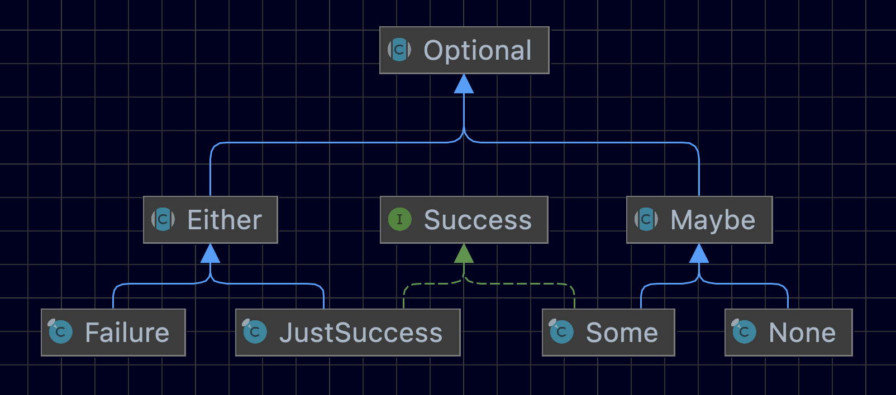

# Classes



Optional is bases on the Left/Right Monad, combines two frequently used Monads, the Maybe and the Either ones.

Both Monads are combined to easy its usage at cost of some correctness.

Either is used when for Success/Failure result, somehow replace the use of exceptions, Maybe when Some or None value 
is expected, willing to replace the use of null.

Usage examples can be found in **OptionalExamplesTest.php**.

# Creating

An **Optional** must be created by:

## Maybe

A value (or absence of) wrapper.  

### None::create() 
Results in a **None**
### Some::from($value) 
Results in a **Some**

## Either

An operation success/failure.

### JustSuccess::create() 
Results in a **JustSuccess**
### Failure::create() 
Results in a **Failure**
### Failure::because($reason) 
Results in a **Failure**, $reason can be either a string based **Reason** or a **ThrowableReason** wrapping an exception
either captured or either created in order to express the failure reason.

## Optional

### Optional::do($value, ...$parameters)
When *$value* is not a callable:
* When *$value* is an **Optional**, it is returned as is.
* On **NULL**, a **None** is returned.
* Otherwise, a **Some** wrapping $value is returned.

When *$value* is a callable, it is called with the given *$parameters*, the result is then used as described above but 
if an exception/error is thrown during *$value* execution, a **Failure** wrapping the thrown exception/error as reason
is returned.

**safe($value)** is a handy alternative and somehow preferred.

## Success
Success is just a tag interface for **Some** and **JustSuccess** as both values represent a successful 
operation result.

## Optionals
It is just an Optional collection with some filtering capabilities.

[Optionals documentation](Optionals.md)

# Getting values

Just valued **Optional**s (**Some**) can return a value directly by 
```PHP
public function get()
```
all **Optional**s but, can either return its value or a default one.
```PHP
public function getOrElse($defaultValue)
```
getOrElse will either return the **Optional** value if it is a **Some** or *$defaultValue* as it is.

```PHP
public function takeOrElse($propertyName, $defaultValue)
```
When a property or result of an **Optional** is need, **Optional::takeOrElse()** can be used,
this will return either the result of calling *$propertyName* (or accessing the *$propertyName* 
on the **Optional**'s value, or if the value is an array, its index value, 
or *$defaultValue* if neither exists, or the **Optional** is not a **Some**

Sometimes exists the need to either return the **Optional** value or a **RunTimeException** as we
expect at some point that the **Optional** must be a **Some** and not being one it is a bug or failure
in our domain logic, **Optional::getOrRuntimeException()** (or its alias **getOrFail()**) is used in such cases.

```PHP
public function getOrRuntimeException(string $message = '')
public function getOrFail(string $message = '')
```

# Optional binding
Optional provides several way to bind (chain).

When binding, if the *$value* is a callable, it is called with the **Optional** as first argument.

### orElse
```PHP
abstract public function orElse($value): Optional;
```
**Optional::orElse** is used to provide an alternative when the **Optional** is not 
a **Success** one, so it is a reaction to a failure.

On **Failure** or **None** this will return the given *$value* evaluation.
On **Some** or **JustSuccess** this will return the **Optional** itself.

### andThen

```PHP
abstract public function andThen($value): Optional;
```
**Optional::orElse** is used to follow the execution on a happy path, 
evaluates when the **Optional** is a **Success** one, 
so it is a reaction to a success.

On **Failure** or **None** this will return the **Optional** itself.
On **Some** or **JustSuccess** this will return the given *$value* evaluation.

### on
```PHP
public function on(class-string|callable(Optional<T>):bool|bool $condition, $value)
```
In the line of **Optional::orElse** or **Optional::andThen**, **Optional::on**
evaluates **$value** when *$condition*:
* is a string and the optional is of such class (classname).
* is a callable and the result of calling **$condition($this)** is **true**
* is a boolean and **true**

### assert
```PHP
public function assert($condition, string $message = null): Optional
```
If the **Optional** is a Failure, return the same **Optional**.
If the optional is a valued one and *$condition* is true 
(or a callable like **function(Optional): bool** that evaluates to true) 
returns the **Optional** itself. Otherwise, if the optional is not a values one (i.e. not a **Some**) or evaluates 
to false, returns a **Failure** with the given *$message* or 'Failed assertion' if not specified.

### orFail
```PHP
public function orFail(string $message, Throwable $throwable = null): Optional
```
If the **Optional** is a Failure or **None** (i.e. is not a **Success**), throws a **\RuntimeException**, otherwise returns itself.
 
# Being lazy
Often it is convenient to be lazy, specially when providing function results as
*$value* to **Optional::orElse**, as the execution of the function itself is desired
not on evaluating the **Optional**'s use statement, but conditionally. In such 
cases the used patter is to wrap the function invocation on a closure (or arrow function).
That is true specially on function that cause effects (i.e. modifies the external word, like
change database value, creating files, or sending email/commands).

For instance,

```PHP
safe($this->insertCustomer($entityManager)($customer))
    ->orElse(apply($this->updateCustomer($entityManager), $customer))
```

Here both **apply** and **$this->updateCustomer** return a function so the evaluation of the 
database mutating code is deferred until **orElse** evaluated it when **insertCustomer** fails.

A common pattern to deffer this kind of calls is just to wrap them in an arrow function.
```PHP
safe($this->insertCustomer($entityManager)($customer))
    ->orElse(fn() => $entityManager->update($customer))
```
be aware to be able to bing furthermore, in this case *$entityManager->update($customer))* must
return a **JustSuccess** or a non-null value on success, or a **Failure** or null on failure.